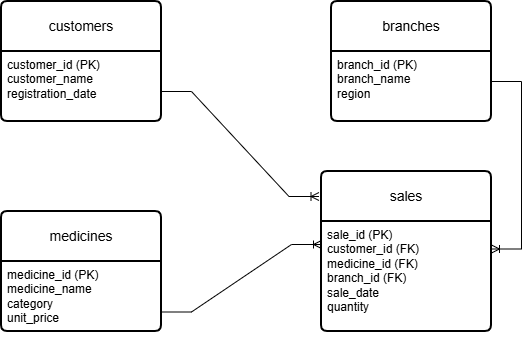
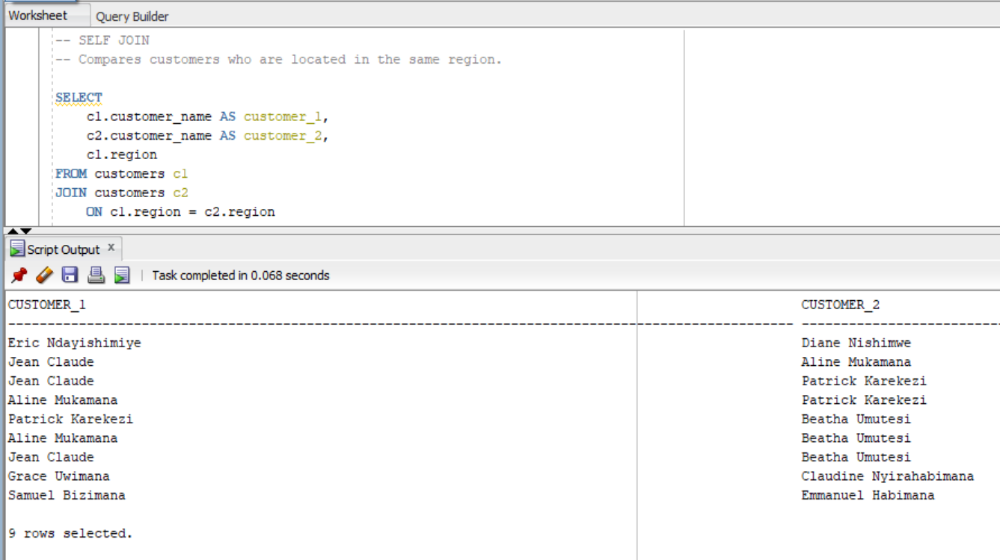
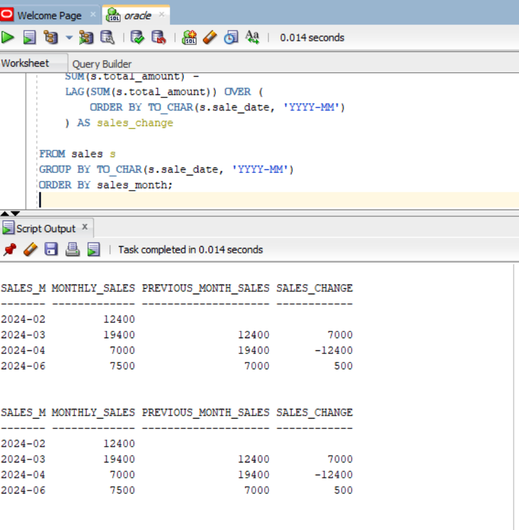

# SQL JOINs & Window Functions Project  
## Pharmacy Sales Analysis System

**Names:** BYIRINGIRO Gad 
**ID:** 28355  
**Course:** Database Development with PL/SQL (INSY 8311)  
**Instructor:** Mr. Eric Maniraguha  
**Institution:** Adventist University of Central Africa (AUCA)  
**Submission Date:** sunday 08, 2026  

---

## 1. Assignment Overview

This project is an Individual Assignment I for the course **Database Development with PL/SQL (INSY 8311)**.  
The goal of the assignment is to increase practical understanding of SQL JOINs and SQL Window Functions by solving a realistic business problem using a relational database.

All queries were implemented and tested using **Oracle Database 21**, and the results are documented with screenshots.

## 2. Business Problem Definition

### Business Context

**Company:** Pharmacy Sales Analysis System  
**Industry:** Health  
**Department:** Sales Analytics  
**Locations:** different branches in Different districts of Rwanda  
**Operation:** selling medical products  

The pharmacy records daily sales transactions involving customers, medicines, and branches.

### Data Challenge
Although sales data is collected every day, the pharmacy lacks proper analytical reporting.  
It is difficult to identify which medicines perform best in each branch, how customer spending differs, and how sales change over time.

### Expected Outcome
The expected outcome is to generate clear analytical insights that help management:
- Monitor branch performance  
- Identify high-value customers  
- Track sales trends  
- Support data-driven decisions for inventory and marketing  

## 3. Success Criteria

The project is considered successful if the following five measurable goals are achieved:

1. Identify **top 5 medicines per branch** using `RANK()`  
2. Calculate **running monthly sales totals** using `SUM() OVER()`  
3. Measure **month-to-month sales changes** using `LAG()`  
4. Group customers into **spending levels** using `NTILE(4)`  
5. Calculate **three-month moving averages** using `AVG() OVER()`  

---

## 4. Database Schema Design

The database consists of **four related tables**:

- `customers` – stores customer information  
- `branches` – stores pharmacy branch details  
- `medicines` – stores medicine information  
- `sales` – stores sales transactions  

Primary and foreign keys are used to maintain data integrity.

### Entity Relationship Diagram (ER Diagram)
The ER diagram shows how customers, medicines, branches, and sales are related.

**ER_Diagram**  
  

---

## 5. Project Folder Structure
database/  
  ├─ 01_create_tables.sql  
  ├─ 02_insert_customers.sql  
  ├─ 03_insert_branches.sql  
  ├─ 04_insert_medicines.sql  
  ├─ 05_insert_sales.sql  

joins/  
  ├─ inner_join.sql  
  ├─ left_join.sql 
  ├─ right_join.sql  
  ├─ full_outer_join.sql  
  ├─ self_join.sql  

window_functions/  
  ├─ ranking.sql  
  ├─ aggregate.sql  
  ├─ navigation.sql  
  ├─ distribution.sql   

diagrams  
  ├─ER_Diagram_pharmacy  
  ├─all_tables_created  

screenshots/  
  ├─ tables/  
  ├─ joins/  
  ├─ functions/  

README.md

## 6. Part A — SQL JOINs Implementation

The following JOIN types were implemented using the same database schema:

1. **INNER JOIN**  
   Retrieves sales records that have matching customers, medicines, and branches.  
    

2. **LEFT JOIN**  
   Identifies customers who have never made a purchase.  
    

3. **RIGHT JOIN / FULL JOIN**  
   Detects medicines that have not been sold.  
    

4. **FULL OUTER JOIN**  
   Compares customers and medicines including unmatched records.  
    

5. **SELF JOIN**  
   Compares customers within the same branch or region.  
    

Each screenshot is showing the SQL query and its output although some reduced due to the size of PC.

## 7. Part B — Window Functions Implementation

We impremented All four categories of window functions as mentioned in the expected outcomes where describled below with respective outcomes.

### 7.1 Ranking Functions
Functions used:
- `ROW_NUMBER()`  
- `RANK()`  
- `DENSE_RANK()`  
- `PERCENT_RANK()`  
    
Use case: ranking medicines and customers by total sales.

### 7.2 Aggregate Window Functions
Functions used:
- `SUM()`  
- `AVG()`  
- `MIN()`  
- `MAX()`  
    
Both `ROWS` and `RANGE` frames were applied to calculate running totals and trends.

### 7.3 Navigation Functions
Functions used:
- `LAG()`  
- `LEAD()`  
    
Used to analyze month-to-month changes in sales.

### 7.4 Distribution Functions  
Functions used:
- `NTILE(4)`  
- `CUME_DIST()`  
    
Used to segment customers based on spending behavior.

## 8. Results Analysis

### Descriptive Analysis (What Happened?)  
- Some branches generated higher sales volumes than others  
- A small group of customers contributed most of the revenue  
- Certain medicines were consistently top performers  which can predict a specific disease that is common in a a given region

### Diagnostic Analysis (Why Did It Happen?)  
- Branch location influenced customer purchase inscrease or dicrease 
- Frequent customers purchased higher quantities  
- Seasonal demand affected monthly sales trends  

### Prescriptive Analysis (What Should Be Done?)  
- Increase stock for high-demand medicines  
- Focus marketing efforts on high-value customers  
- Monitor underperforming branches and products  

---

## 9. Screenshots Guide

All screenshots included in this project show:
- The SQL query  
- The execution result  

They are organized as follows:
- `screenshots/tables/` → table creation and data verification  
- `screenshots/joins/` → JOIN queries and results  
- `screenshots/window_functions/` → window function outputs  

## 10. References

- Oracle Documentation – SQL Analytic Functions  
- Oracle Base – Analytic Functions Guide  
- W3Schools – SQL Window Functions  
- Course lecture notes (INSY 8311)

## 11. Academic Integrity Declaration

I declare that this project is my own work and was completed in accordance with the academic integrity guidelines of AUCA.

## 12. Final Note

This project reflects my learning progress in SQL JOINs and Window Functions.  
All queries were written, tested, and analyzed by me.

